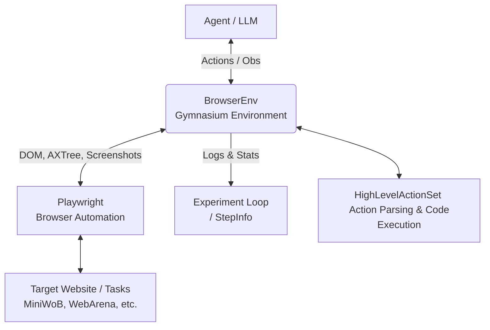
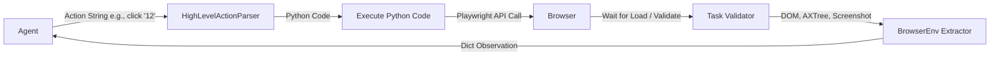
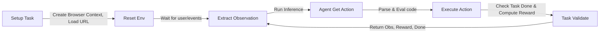

# Code Audit Report

## 1. Problem Statement
BrowserGym solves the problem of evaluating and training AI web agents by providing a unified, standardized environment (compatible with Gymnasium) that wraps a headless browser (Playwright) and multiple distinct web automation benchmarks (like MiniWoB, WebArena, WorkArena, etc.). This allows researchers to write an agent once and test it seamlessly across diverse benchmarks using a consistent observation (DOM, accessibility tree, screenshots) and action space (high-level semantic UI interactions).

## 2. Architecture Diagram



**Architectural style:** Modular layered architecture. The `BrowserEnv` (gym environment layer) wraps Playwright (browser control layer) and connects it to the Task layer (benchmarks) and the Agent layer (user code), while an Experiment Loop layer handles orchestration and logging.

## 3. Data Flow Diagram



## 4. Pipeline


- **Setup Task:** A specific benchmark task initializes the browser, loads the starting URL, and defines the goal.
- **Extract Observation:** DOM snapshot, Accessibility Tree, screenshot, and current chat state are gathered and normalized.
- **Agent Action:** The agent receives the observation and returns a high-level command (e.g., `click(12)`).
- **Execute Action:** The command is converted to Playwright commands via python execution.
- **Task Validate:** The benchmark checks the page state to determine if the task goal is achieved and returns a reward/done signal.

## 5. Tech Stack

| Layer | Technology | Version | Where used (file) |
| --- | --- | --- | --- |
| Language | Python | >= 3.10 (implicit) | Repository-wide |
| RL Interface | Gymnasium | - | `browsergym/core/src/browsergym/core/env.py` |
| Browser Automation | Playwright | - | `browsergym/core/src/browsergym/core/env.py` |
| Serialization | Dataclasses, JSON, Pickle | - | `browsergym/experiments/src/browsergym/experiments/loop.py` |
| AI Integration | OpenAI API | - | `demo_agent/agent.py` |
| Documentation | Sphinx, ReadTheDocs | - | `docs/src/conf.py` |
| Image Processing | PIL (Pillow), NumPy | - | `demo_agent/agent.py` |

## 6. Problems Found

- **Title:** Use of `eval`/`exec` for Action Execution
  - **Severity:** High
  - **Category:** Security / Architecture
  - **Location:** `browsergym/core/src/browsergym/core/env.py` (Line 453)
  - **What is wrong and why it matters:** High-level actions strings returned by the LLM are directly parsed into Python code strings and evaluated using `exec()` (`execute_python_code` in `env.py`). If an agent generates malicious python code, or is exposed to prompt injection on a live website, it could execute arbitrary code on the host machine.
  - **Suggested fix:** Instead of evaluating strings of python code, parse the action string directly into Python function calls and dispatch them explicitly, or heavily sandbox the `exec` environment.

- **Title:** Hardcoded AssistantBench Hacks
  - **Severity:** Medium
  - **Category:** Architecture
  - **Location:** `browsergym/experiments/src/browsergym/experiments/loop.py` (Lines 79-84)
  - **What is wrong and why it matters:** `EnvArgs.make_env` contains a hardcoded hack to inject an output file path for `assistantbench` tasks into `task_kwargs`. This breaks encapsulation and indicates that the environment configuration API is not generic enough to handle benchmark-specific outputs gracefully.
  - **Suggested fix:** Allow benchmarks to query the experiment directory directly via a standardized interface (e.g. `env.set_experiment_dir()`), or pass an output directory as a standard environment argument.

- **Title:** Deprecated Gymnasium Types
  - **Severity:** Low
  - **Category:** Code quality / Technical Debt
  - **Location:** `browsergym/core/src/browsergym/core/env.py` (Lines 180-182, 196-198)
  - **What is wrong and why it matters:** `active_page_index` and `elapsed_time` are defined using `gym.spaces.Box`, but comments explicitly indicate "TODO: change to an Integer / Float (breaking change for users)". This indicates technical debt that could cause confusion or integration issues for users expecting standard scalar types.
  - **Suggested fix:** 
    ```python
    "active_page_index": gym.spaces.Discrete(255),
    "elapsed_time": gym.spaces.Box(low=0, high=np.inf, shape=(), dtype=float)
    ```

- **Title:** Broad Exception Catching in Experiment Loop
  - **Severity:** Low
  - **Category:** Code quality
  - **Location:** `browsergym/experiments/src/browsergym/experiments/loop.py` (Lines 457-484)
  - **What is wrong and why it matters:** The `finally` block in `ExpArgs.run()` wraps multiple critical cleanup functions (saving state, closing env) in individual broad `except Exception` clauses. While it prevents one cleanup from breaking another, it relies on extensive logging and might mask systematic failures in the experiment loop cleanup.
  - **Suggested fix:** Explicitly handle expected exceptions (like `IOError` or `playwright.sync_api.Error`) rather than catching `Exception` indiscriminately.

## 7. Summary
- **Overall health score:** 9/10. The codebase is very modular, well-structured, integrates many complex tools cleanly, and abstracts away browser complexities into a familiar RL interface seamlessly.
- **Top 3 things to fix first:**
  1. Sandboxing or replacing the `exec()`-based action execution to prevent RCE from prompt-injected LLM outputs.
  2. Removing the hardcoded benchmark-specific hacks in the generic experiment loop (`loop.py`).
  3. Resolving the stated TODOs in the gymnasium observation spaces for `active_page_index` and `elapsed_time`.
